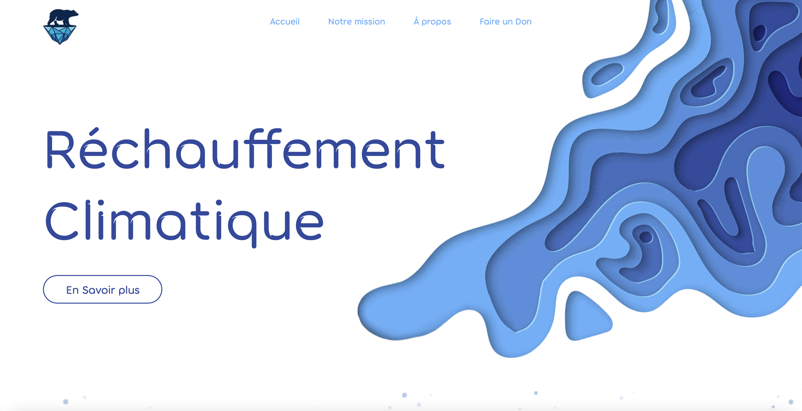
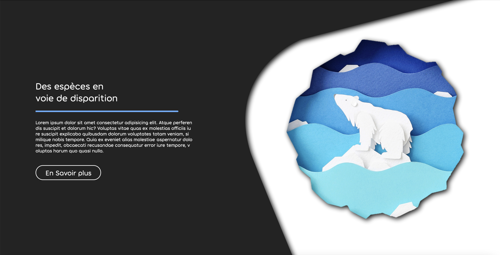

# global-warming
### (FR) Projet de site vitrine pour une association
---

### *RÉALISÉ PAR*
---
* Ludovic Vostès -> [https://github.com/ludovostes](https://github.com/ludovostes) 

### *LE CODE*
---
* HTML
* CSS
* JavaScript

### *LE PROJET*
---
Une association fictive, souhaite mettre en avant son action dans la lutte contre le réchauffement climatique. Description des actions et des dangers pour sensibiliser le plus large public possible ainsi qu'une demande de dons.

### *LA MISSION*
---
* Intégration d'un site vitrine one-page.
* Responsive.
* Création et inégration de quelques effets CSS.
* Un visuel simple, moderne et design.
* Projet fictif.

